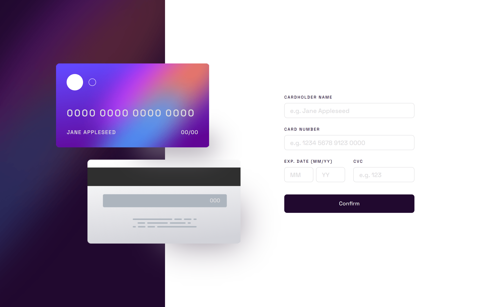

# Frontend Mentor - Interactive card details form solution

This is a solution to the
[Interactive card details form challenge on Frontend Mentor](https://www.frontendmentor.io/challenges/interactive-card-details-form-XpS8cKZDWw).
Frontend Mentor challenges help you improve your coding skills by building
realistic projects.

## Table of contents

-   [Overview](#overview)
    -   [The challenge](#the-challenge)
    -   [Screenshot](#screenshot)
    -   [Links](#links)
-   [My process](#my-process)
    -   [Built with](#built-with)
    -   [What I learned](#what-i-learned)
    -   [Continued development](#continued-development)
    -   [Useful resources](#useful-resources)
-   [Author](#author)

## Overview

### The challenge

Users should be able to:

-   Fill in the form and see the card details update in real-time
-   Receive error messages when the form is submitted if:
    -   Any input field is empty
    -   The card number, expiry date, or CVC fields are in the wrong format
-   View the optimal layout depending on their device's screen size
-   See hover, active, and focus states for interactive elements on the page

### Screenshot

### Links

-   [My solution](https://github.com/c0dehamster/form-handling-demo-svelte)
-   [Live Site](https://form-handling-demo-svelte.vercel.app/)

## My process

### Built with

-   Semantic HTML5 markup
-   CSS custom properties
-   Flexbox
-   CSS Grid
-   Mobile-first workflow
-   [Svelte](https://svelte.dev/) - JS framework

### What I learned

Working on this project, I continued learning about form handling in Svelte. I
was able to re-use a lot of code from my previous Frontend mentor challenge but
there were a few new topics for me as well.

The card preview was definitely the most challenging part of the project. I
decided to use it as an opportunity to test new container units. Not sure if it
was necessary. Later I found
[a tutorial on Kevin Powell's channel](https://youtu.be/H04P5YXVssE) where he
used this exact challenge to demonstrate a responsive layout built using
position: absolute. I recommend to check it out to see a simpler approach to the
problem.

I used Svelte stores to make the card display update on input. Stores allow to
declare a variable that can be accessed by any component of the application, and
the component will be re-rendered every time the variable changes. I find it a
very useful feature that eliminates a lot of complexity required to achieve
interactivity.

### Continued development

I used conditional rendering of a simple div to switch between the form and the
completed state. I think this is fine for a small form but a more complex one
would probably require client-side routing.

### Useful resources

-   [Kevin Powell on container units](https://youtu.be/ZSaAHb5dRwQ) - this
    channel is my first choice when I need a detailed explanation of something
    related to CSS

## Author

-   Frontend Mentor -
    [@twDevNoob](https://www.frontendmentor.io/profile/twDevNoob)
